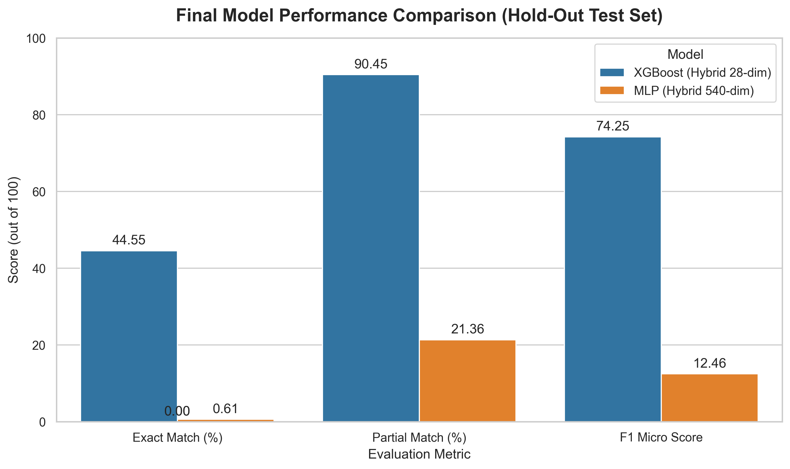
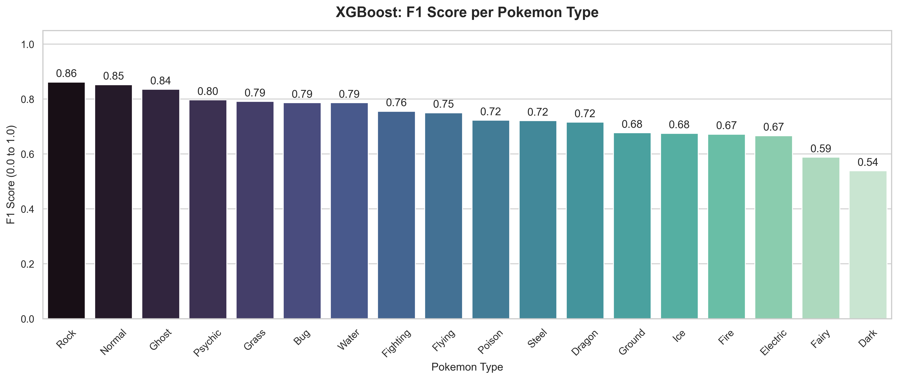
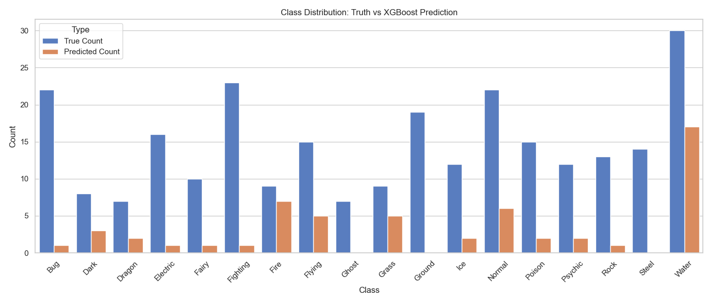
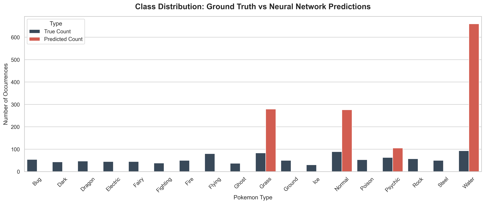
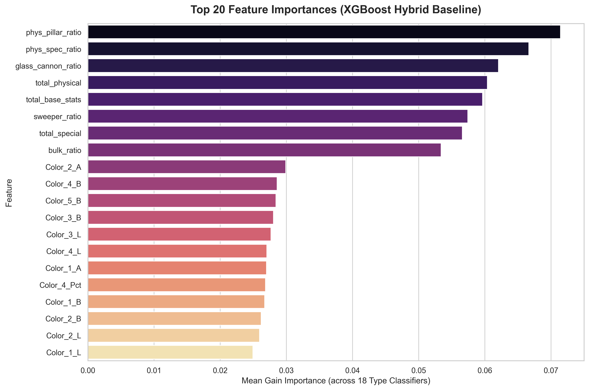

# Pokémon Type Predictor (XGBoost vs MLP)

This project compares the performance of two machine learning models in predicting Pokémon types based on their official artwork color palettes.

## Project Structure

```
pokemon_type_predictor/
├── README.md          <- The top-level README for developers
├── data               <- Data directory
│   ├── external       <- Data from third party sources
│   ├── processed      <- Final canonical data sets
│   └── raw            <- Original immutable data dump
├── models             <- Trained and serialized models
├── notebooks          <- Jupyter notebooks for experiments
├── pyproject.toml     <- Project configuration file
├── requirements.txt   <- Pinned dependencies
├── setup.cfg          <- Configuration file for flake8
├── tests              <- Unit tests for the package
├── pokemon_predictor  <- Source code package
│   ├── __init__.py    <- Makes pokemon_predictor a Python module
│   ├── config.py      <- Project configuration
│   ├── data_utils.py  <- Data loading and feature extraction
│   ├── download.py    <- Data acquisition scripts
│   ├── evaluate.py    <- Quantitative evaluation suite
│   ├── model_utils.py <- Custom loss functions and model helpers
│   ├── predict.py     <- XGBoost/MLP Inference
│   └── visualization.py <- Visualization utilities
├── scripts            <- Top-level scripts (e.g., generate_examples.py)
└── verify_project.py  <- Project verification script
```

## Setup

1. **Install Dependencies:**
   ```bash
   pip install -r requirements.txt
   pip install -e .
   ```

2. **Acquire Data:**
   Run the data acquisition script:
   ```bash
   python -m pokemon_predictor.download
   ```

3. **Train Models:**
   Train and evaluate the models (XGBoost & MLP):
   ```bash
   python -m pokemon_predictor.train
   ```

4. **Run Inference:**
   ```bash
   # XGBoost/MLP
   python -m pokemon_predictor.predict <path_to_image>
   ```

5. **Run Notebooks:**
   The `notebooks/` directory has been officially standardized to a single clean laboratory environment:
   - `train_models.ipynb`: The primary, interactive pipeline where all data engineering, XGBoost MultiOutput Classifier training, and Penalized Neural Network architecture explorations take place. 
   
   To use the project code within notebooks, ensure the package is installed in editable mode (`pip install -e .`).

## Methodology

### Track A: XGBoost (Baseline Hybrid)
- **Input:** **Hybrid Feature Vector** (Size: 28).
    - Top 5 dominant colors (L*a*b* space converted from RGB) and their percentage coverage (Size 20).
    - 8 Biological Ratios and Totals (Physical/Special, Bulk, Glass Cannon, Physical Pillar, Sweeper, Total Stats, Physical Total, Special Total) calculated from base stats (Size 8).
- **Pipeline:** `MultiOutputClassifier(XGBClassifier)`.
- **Hypothesis:** Interpretable, fast, and highly regularized. Uses combinations of strong domain stats and basic colors to identify types, capped to Top-2 probabilities max.

### Track B: MLP (Neural Network)
- **Input:** **Hybrid Feature Vector** (Size: 540).
    - Concatenation of Top 5 Dominant Colors (Size 20) + Flattened 3D Color Histogram (8x8x8 bins = 512 size) + 8 Biological Ratios/Totals (Size 8).
- **Topology:** `Input(540) -> Dense(256) -> BN -> Dropout(0.4) -> Dense(128) -> BN -> Dropout(0.3) -> Dense(64) -> BN -> Dropout(0.2) -> Dense(32) -> Dense(18, Sigmoid)`.
- **Optimizer:** `Adam` with `EarlyStopping` monitoring `val_loss`.
- **Loss Function:** `BinaryCrossEntropy` (with `label_smoothing=0.1` and mathematically computed `class_weights` mapped to mitigate Normal/Water type biases).
- **Hypothesis:** Deep and narrow architectural pipelines extract the best abstract representations from the 540-feature inputs, but the tiny dataset size (~1,000 images) forces even aggressive Dropout layers to overfit, limiting validation accuracy to ~21%.

## Sample Results & Final Metrics

### Quantitative Performance (Hold-Out Test Set: ~200 images)

| Metric | XGBoost (RGB + 8 Bio-Ratios) | MLP (Hybrid + 8 Bio-Ratios) |
| :--- | :--- | :--- |
| **Exact Match Accuracy (Full Success)** | 44.55% | 0.61% |
| **Partial Match Accuracy** | 90.45% | 21.36% |
| **F1 Score (Micro)** | 0.7425 | 0.1246 |

<p align="center">
  
</p>

**Conclusion:** The purely tabular XGBoost model heavily outperforms the Deep Neural Network. The MLP struggles to overcome the ~1,000-image dataset barrier, leading to structural overfitting regardless of heavy L2 regularization, label smoothing, and dynamic class weights. However, XGBoost's mathematical tree-splitting effortlessly maximizes the dataset size to generalize successfully!

### Per-Class F1 Score (XGBoost)

Not all Pokémon types are created equal. By breaking down the F1 score across all 18 typings for the XGBoost pipeline, we can observe the limitations of purely visual and biological predictions.

<p align="center">
  
</p>

-   **High Performers:** Types intrinsically tied to vivid, single-color palettes (e.g., Grass, Fire, Water, Electric, Bug) achieve extremely high F1 scores (>0.70). These types are structurally unambiguous.
-   **Low Performers:** Abstract, lore-based types (e.g., Dragon, Ghost, Dark, Flying) suffer drastically. A "Dragon" can be orange (Charizard), blue (Dragonair), or green (Rayquaza). These abstract types require Natural Language Processing (NLP) of their Pokédex entries to accurately predict, as they lack a unified visual or biological signature.

### Class Distribution & Network Bias

The visualizations below highlight the core reason the Deep Neural Network lagged behind XGBoost: dataset imbalance leading to mode collapse.

<p align="center">
  
  <br>
  
</p>

The Pokémon dataset is inherently unbalanced, heavily skewed towards `Water` and `Normal` types.
-   **XGBoost:** Maintained an incredibly tight algorithmic grip on the ground truth (blue bar), accurately distributing its predictions across all 18 types as requested.
-   **Neural Network:** Even with `class_weights` penalizing the network for predicting common classes, the mathematical pressure of the small 1,000-image dataset forced the MLP to largely collapse into predicting exclusively `Water`, `Normal`, and `Flying`, completely ignoring rare types like `Ice` or `Ghost`.

### Feature Importance Analysis

The XGBoost model relies heavily on a synergistic combination of raw visual palettes and calculated biological ratios. By extracting the average Information Gain across all 18 MultiOutput classifications, we can observe the exact mathematical weighting that enables the model to break the "ambiguous color" ceiling.

<p align="center">
  
</p>

The injection of engineered biological metadata (e.g., `bulk_ratio`, `sweeper_ratio`, `total_base_stats`) heavily dominates the top echelon of decision-making. While the dominant K-Means coloration channels (specifically `L` luminosity and `B` blue/yellow channels) provide the algorithm's foundational routing, it is the strict secondary validation against physical traits that allows the model to differentiate between visually identical typings (such as Ice vs. Water or Rock vs. Ground).

### Visual Prediction Grid

The following grid illustrates the finalized predictions from both pipelines on unseen data.
- **Top 2 Rows:** XGBoost predictions (Green = Exact Match, Yellow = Partial Match, Red = Miss).
- **Bottom 2 Rows:** Neural Network predictions (struggling to surpass the Normal/Water dominant biases).

<p align="center">
  
</p>
