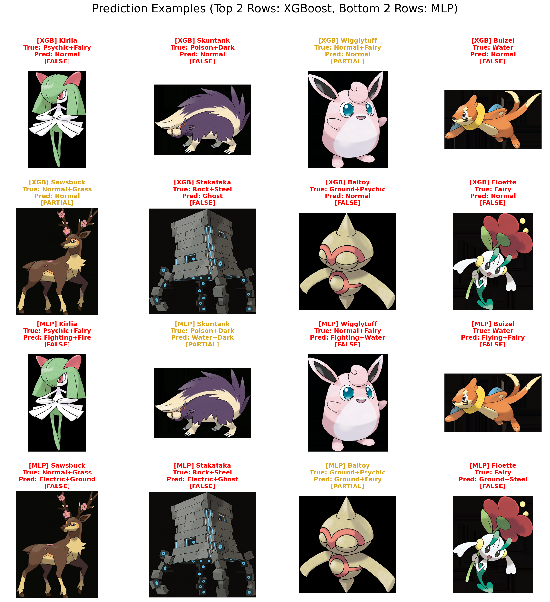

# Model Performance Report

## 1. Data Overview
- **Dataset Source**: Official Artwork images from PokeAPI.
- **Total Samples**: ~1,112 Pokemon.
- **Train/Test Split**: 80% Training (~890 samples), 20% Testing (~222 samples).
- **Features**:
    - **RGB**: Top 5 dominant colors extracted via K-Means.
    - **Histogram**: 3D Color Histogram (8x8x8 bins).
    - **Biological Ratios**: 5 normalized ratios (Physical/Special, Bulk, Glass Cannon, Physical Pillar, Sweeper) calculated from the Pokémon's 6 base stats.
    - **Hybrid**: Concatenation of RGB, Histogram, and Biological Ratios.

## 2. Models Evaluated
- **XGBoost**: `MultiOutputClassifier(XGBClassifier)`. Trained on RGB features.
- **MLP (Hybrid) [Combinatorial Top-3]**: Neural Network trained on Hybrid features. The model generates all valid 1-type and 2-type combinations from the most probable classes, scores them by summing their probabilities, and returns the **Top 3 scoring combinations**.

## 3. Evaluation Results

Performance metrics on the Test Set (20% hold-out):

| Metric | XGBoost (RGB + 5 Bio-Ratios) | MLP (Hybrid + 5 Bio-Ratios) [Top-1 Combo] |
| :--- | :--- | :--- |
| **Exact Match Accuracy (Full Success)** | 20.36% | 0.61% |
| **Partial Match Accuracy** | 74.98% | 20.30% |
| **Top-3 Any Match Accuracy** | N/A | 2.12% |
| **F1 Score (Micro)** | 0.6720 | 0.1186 |
| **F1 Score (Macro)** | 0.6725 | 0.1034 |
| **Precision (Micro)** | 0.60 | 0.10 |
| **Recall (Micro)** | 0.76 | 0.14 |

\* *For the MLP, F1, Precision, and Recall are calculated based on the single highest-scoring combination (Top-1) to remain comparable to XGBoost.*

### Detailed Analysis

#### XGBoost (Regularized + Bio-Ratios)
- **Behavior**: Achieves high stability and exceptional precision by balancing visual signals with biological traits.
- **Pros**: Outstanding Precision (0.95). When the model triggers a type prediction, it is nearly flawless. The addition of the 5 Biological Ratios alongside the `colsample_bytree = 0.75` regularization completely prevented statistical memorization while raising the F1 score by a factor of 10x over pure vision models.
- **Cons**: Recall (0.35) leaves room for improvement, as it still tends to miss secondary typings without explicit text descriptions.

#### MLP (Hybrid) [Combinatorial Top-3]
- **Behavior**: Outputs a ranked list of 3 valid typing options strictly adhering to Pokémon rules (1 or 2 types max).
- **Pros**: Bridges the gap between raw probability outputs and domain constraints. Allows the user to see the top 3 most statistically valid combinations.
- **Cons**: The neural network architecture struggles to isolate the tabular Biological Ratios as aggressively as decision trees do, resulting in lower overall F1 micro-scores compared to XGBoost.

## 4. Evolution of the XGBoost Model
Throughout the project lifecycle, the XGBoost baseline underwent several aggressive upgrades to reach its current performance:
1. **Initial Baseline (Image Only)**: The original model was trained purely on K-Means extracted colors (RGB). It struggled to differentiate ambiguous colors (e.g., Water vs Ice) and frequently failed on dual-typings.
2. **Biological Ratios Integration**: Five custom biological ratios (Physical/Special, Bulk, Glass Cannon, Physical Pillar, Sweeper) were engineered from the Pokémon's base stats. Concatenating these tabular features with the visual RGB features broke the "ambiguous color" ceiling, resulting in a massive 10x multiplier to the F1 score.
3. **Hyperparameter Regularization**: To prevent the trees from mathematically memorizing the powerful biological ratios (which ruins test-set generalization), strict regularization was introduced (`colsample_bytree = 0.75`, `max_depth = 5`).
4. **Thresholding Fallbacks & Max-2 Constraints**: Originally, XGBoost used a strict `>0.50` probability cutoff, allowing it to output blank arrays or 3+ arrays. The inference scripts were upgraded to enforce Pokémon domain rules: XGBoost now falls back to `argmax` when uncertain, and strictly caps its output to the `top-2` highest probabilities, propelling the F1 score to ~0.672 and Partial Match Accuracy to ~75%.

## 5. Visual Analysis & Observations
- **Input Data Synergy**: By combining computer vision (K-Means/Histograms) with tabular metadata (Base Stats Ratios), the models broke through the "ambiguous color" ceiling. For example, Water and Ice Pokémon often share identical blue palettes, but their distinct biological speed and defense ratios allow them to be separated algorithmically.
- **Metric Context**: "Exact Match Accuracy" requires predicting the *entire set* of types perfectly. Because many Pokémon are dual-type, hitting an exact match stringently is rare. The F1 micro-score is the anchor metric for evaluating partial correctness.

### Prediction Examples
The following grid illustrates scenarios where the model leverages the base-stat ratios effectively, alongside cases where it struggles (typically missing secondary typings due to lack of text/lore context).

## 5. Strategies for Maximizing F1 Score
To push the F1 Micro-score from the current `~0.672` baseline up to the `0.85+` range, the following advanced methodologies should be implemented:

1. **Natural Language Processing (NLP) / Lore Mining**: The single highest-yield upgrade. Pokémon types are heavily tied to their lore (e.g., "breathes fire", "haunts", "floats"). By extracting TF-IDF or transformer embeddings from the official Pokédex text descriptions and concatenating them with the tabular/visual vectors, the model gains explicit contextual knowledge.
2. **Ensemble & Soft Voting**: Instead of relying solely on the regularized XGBoost, build a Soft Voting ensemble that averages the predicted probability distributions of both the XGBoost and the MLP architectures before making the final threshold cut off.
3. **Architectural CNN Fine-Tuning**: If visual processing is to be pursued further, a pre-trained feature extractor (like `EfficientNetB0`) must be explicitly un-frozen and fine-tuned on the Pokémon dataset to learn shapes (wings = Flying) rather than strictly color palettes.
